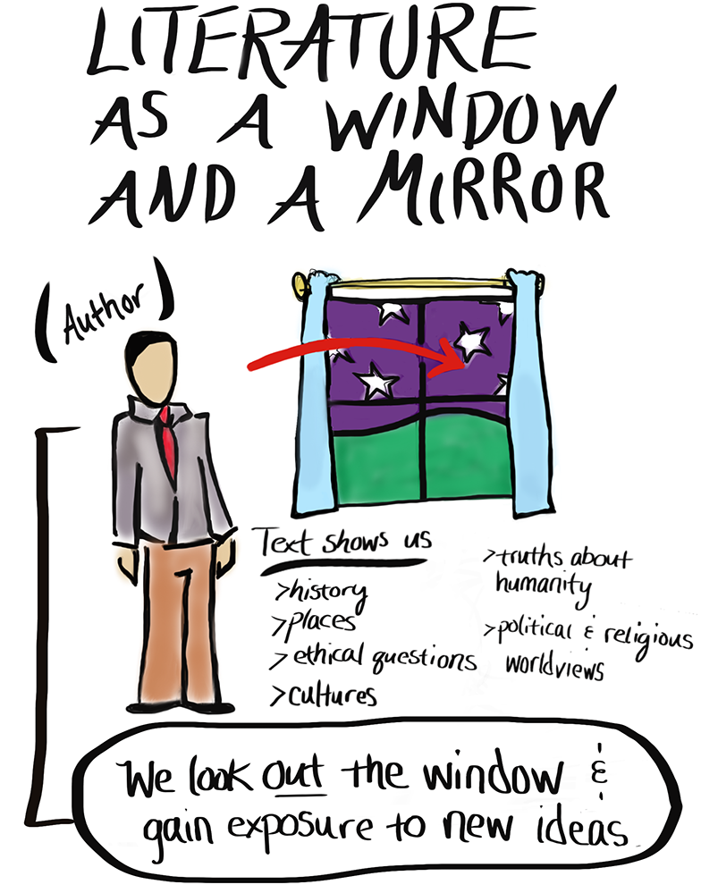
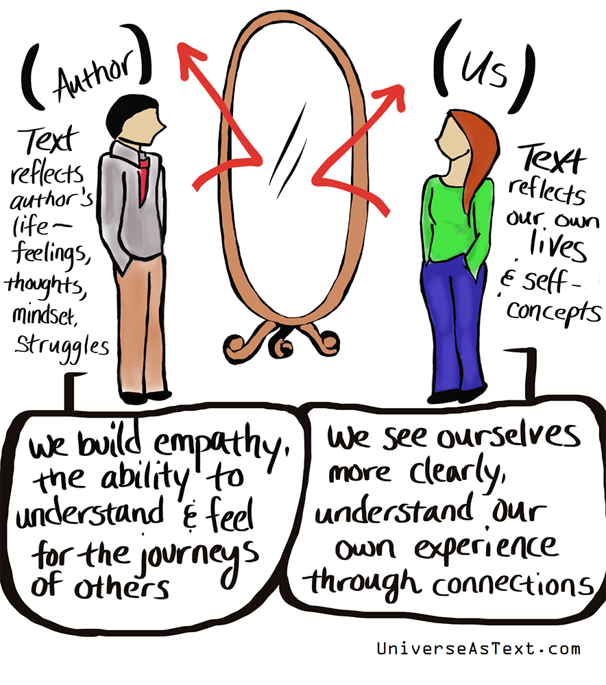

## Learning Goals

We are learning to:
-   read complex and challenging texts for meaning
-   analyze the elements of a personal essay
-   plan a personal essay
-   make connections within and between various texts
## Success Criteria

I am able to:
-   use reading strategies to find meaning in personal essays
-   analyze form, style and purpose in personal essays
-   explain the use of mood, tone and diction in personal essays
-   organize a personal essay using a model
-   reflect on how resilience is portrayed in various texts

## 1. MINDS ON 专心致志

### 1.1 Resilient storytelling

In the previous learning activity, you explored the idea that being a life-long learner requires both motivation and resilience. In this learning activity, you will consider resilience from a different perspective. You will focus on how telling and sharing stories relate to resilience.
在本次学习活动中，您将从不同的角度考虑韧性。
您将重点关注讲述和分享故事与韧性的关系。

Get started by exploring the following 60-second life stories.

### 1.2 Think

These video clips are just two of the many stories available online. Research additional stories, or think about recent stories you may have encountered. Consider the following questions.

- Are there stories that affect you more than others? Consider why this may be.
- How might storytelling help build resilience? Think back to the synonyms for resilience and adversity at the beginning of the course.
- 有哪些故事对你的影响比其他人更大？ 考虑一下为什么会这样。
- 讲故事怎么样帮助建立毅力？ 回想一下课程开始时韧性和逆境的同义词。
### 1.3 The personal essay

Storytelling is an important tradition for many cultures and people around the world. 
Some believe that it is ingrained into our DNA as human beings. 
Next, you will be exploring a ==specific== type of storytelling form: ==the personal essay==. 
You are probably most familiar with formal essays. Personal essays are similar, but not the same. Select the following tabs to learn more.

ingrained 根深蒂固

#### personal essay

A personal essay is told with ==descriptive== details and is similar to a personal story or memoir.

descriptive 描述性的

> The core of a personal essay is inward reflection about yourself. This includes insights you have gleaned about your abilities and strengths, significant personal growth you made and what you still need to work on.
> 
> Source: Seattle PI

个人论文的核心是==对自己的内心反思==。
这包括您收集到的
- 关于您的能力和优势的见解
- 您取得的重大个人成长
- 以及您仍需要努力的方面。

三步骤，非常清楚，
#### formal essay

Like a formal essay, a personal essay conveys a specific point of view or thesis. The thesis can be explicit, but more often it has to be inferred by the reader.
与正式论文一样，个人论文传达了特定的观点或论述。 论述可以是明确的，但更多时候必须由读者推断。

> In a formal essay, a reader is presented with evidence and a conclusion; 
> 
> in a personal essay, a reader is treated to the author wrestling with a problem…. 
> Personal essays work best when they are interesting and entertaining but more so when they provoke a response, whether sympathy or outrage or laughter or head-shaking astonishment.
> 
> Source: Best Canadian Essays 2017

在正式的论文中，向读者提供证据和结论；
在一篇个人论文中，读者会看到作者正在努力解决一个问题…… 
当个人文章吸引人且有趣时，效果最好，但当它们引起反应时，效果更佳，无论是同情、愤怒、笑声还是令人摇头的惊讶。

## 2. Action

### 2.1 Storytelling through personal essays

Storytelling is a way to persevere and ensure that a part of us survives and thrives.
讲故事是一种坚持并确保我们的一部分生存和发展的方式。

Author Ursula K. Le Guin says, "there have been great societies that did not use the wheel, but there have been no societies that did not tell stories."
作家乌苏拉·K·勒古恩 (Ursula K. Le Guin) 说：“曾经有过不使用轮子的伟大社会，但没有不讲故事的社会。”

Reading stories in the form of personal essays that describe what it’s like to face challenges can broaden our understanding of what it means to be resilient and human.
阅读以个人文章形式描述面对挑战的故事，可以拓宽我们对坚韧和人性意味着什么的理解。

Consider the following tree diagram to explore how personal essays fit with other forms of descriptive and narrative writing. 
This is not an exact science. In most writing, you’ll often find the branches overlapping. As such, the personal essay borrows from written forms like short stories, memoirs, and other essay structures.
考虑下面的树形图，探索个人论文如何与其他形式的描述性和叙述性写作相结合。 
这不是一门精确的科学。
在大多数写作中，您经常会发现分支重叠。
因此，个人论文借鉴了短篇小说、回忆录和其他论文结构等书面形式。

/course_content/assets/img/eng4c_01.02_tree.jpg?_&d2lSessionVal=B7dmJozD5R4Ug3aoDK83RllbY&ou=22862564)

The image shows a labelled diagram of a tree. 
The head of the tree is divided into three sections. 
- personal essay. 
- descriptive essay
- short story

personal essay
- emotions, anecdotes, thoughts and opinions, diary entries, and memoir. 
- 情感、轶事、想法和意见、日记和回忆录。

The "Descriptive Essay" section has branches labeled: imagery, five senses, and moment by moment. The "Short Story" section has branches labeled: plot, setting, characters, and genres. The branches from all three sections of the head of the tree lead to the trunk of the tree, which is labeled: description. The truck splits into three main roots. The root on the left is labeled: confessional writing. The root in the middle is labeled: observational writing. The root on the right is labeled: imaginative fiction.

### 2.2 Review- Reading Strategies

Before you start reading D’Angelo’s essay (and essays in general), you may find it helpful to review a variety of reading strategies.
您可能会发现回顾各种阅读策略很有帮助。

Using reading strategies intentionally will help you develop and improve your reading skills. Review each of the reading strategies by selecting the following tabs.

#### A. Ask yourself questions

For example, ask yourself, “what does the writer mean by …?” or “what do I need to know more about to understand …?”

有意识的增加和文本的互动

#### B. Adjust your pace
调整你的步伐

If you find the text challenging, take more think time to process meaning. 
You may need to reread or pause to think and review.

#### C. Read between the lines
字里行间

Link ideas and draw conclusions. Consider what is implied, or suggested, as well as what is clearly written on the page.
链接想法并得出结论。 
考虑文本中，哪些是暗示或建议的内容，哪些是纸面上明确写的内容。

#### D. Visualize
可视化

Develop a mental image as you read. Some people describe reading a novel as “a movie running through their minds.
阅读时在心里形成一个形象。 
有些人将阅读小说描述为“一部在他们脑海中闪现的电影”。
#### E. Make predictions
做出预测

As you read, think about what might happen next.

#### F. Take notes

Jotting down main ideas and questions can help you remember key information and track your own thinking as you read. In addition, consider looking up the meaning of difficult words and creating a vocabulary list. You can also add notes to the margins of what you are reading (called annotating) to help you guide your reading and deepen your understanding.

记下主要想法和问题可以帮助您记住关键信息并在阅读时跟踪自己的想法。 
此外，考虑查找困难单词的含义并创建词汇表。 
您还可以在正在阅读的内容的页边添加注释（称为注释），以帮助您指导阅读并加深理解。

Consider consulting this annotation guide and using digital annotation tools such the comment feature in Google Docs or Microsoft Word.
考虑查阅本[注释指南](./1.2_resources_Making-Annotations-A-User’s-Guide) 并使用数字注释工具，例如 Google Docs 或 Microsoft Word 中的注释功能。
#### G. Make connections

Make connections between what you are reading and your own knowledge and experiences. What does the text remind you of? How does the text relate to other things you have learned, seen, heard about, or done? This is sometimes called “mental Velcro,” because you are attaching new information to ideas you already have.

将您正在阅读的内容与您自己的知识和经验联系起来。 
- 文字让你想起什么？ 
- 文本与你所学、所见、所听或所做的其他事情有何联系？ 

这有时被称为“心理魔术贴”，因为你将新信息附加到已有的想法上。

### 2.3 Read

### read story
The first personal essay you will be reading is "**The Step Not Taken**", by Paul D'Angelo. In the essay, the author describes an elevator encounter that has had a profound influence on him. 作者讲述了一次对他影响深远的电梯遭遇。

As you read, notice how this essay is different from the standard five-paragraph essays you may have experienced in other courses.

[The Step Not Taken](./1.2_resources_The Step Not Taken) by Paul D’Angelo

### Analyzing the personal essay - two frameworks

There are many ways to ==make meaning== from something you read. 
有很多方法来==理解==你阅读的材料。
The reading strategies are very helpful when you're reading a new text. In this section, you will be introduced to two additional ways of deconstructing what you are reading. Each works well with essays:
- 'Analyzing form and style' 
- and 'Using paragraph titles'.
每一种方法都在论文中表现出色：
- “分析形式和风格”
- 以及“使用段落标题”。
#### A. Analyzing form and style

Analyzing an essay based on form and style means **breaking the essay into its individual parts**, like the introduction, thesis, body, and conclusion.

Once you have read “The Step Not Taken,” select each of the following tabs to explore guiding questions and answers. If you want to challenge yourself, answer the questions in your notebook first, and then compare your thinking with the suggestions provided.

##### introduction

**How does the author grab the reader’s interest in the first paragraph?**
The author begins by describing a typical scene from his life, but then adds a sentence at the end of the paragraph that makes you wonder what is going to happen next. The phrase “Nothing at all to indicate what was about to take place” triggers anticipation in the reader.

##### Thesis

**What is the thesis or main idea?**
The author expresses his main idea in the sentence “And what I did next still shames me.” (third paragraph). He then goes on to provide evidence for how and why he feels regret.

##### Evidence

**What is the evidence to support the thesis? Give at least three examples.**
The following examples from the essay support a thesis of “feeling shame.”
- He asks himself a series of questions about whether to help the other man (fourth paragraph), but takes no action.
- He continues to be haunted by his inaction and wonders what the other man is going through or struggling with (sixth and seventh paragraphs).
- His regret or shame leads him to reflect on how he should have acted (eleventh paragraph).

##### Descriptive Phrases

**What descriptive phrases or imagery does the author use?**
作者使用了哪些描述性短语或图像？
Some of the descriptive phrases the author uses include “face crumbling before he turns to the wall”, “his shoulders heave as he sobs in a combination of sorrow and shame”, and “unload his sadness onto my shoulders.”

##### Conclusion

**How does the author conclude the personal essay?**
The author ends with a statement about how he feels now about his actions in the situation described. He says, “that I’m sorry.”

##### Organization

**How are events presented in the essay? Chronological? Non-linear? Flashback? Other?**
文章中如何呈现事件？ 按时间顺序排列？ 非线性？ 倒叙？ 其他？
The author’s experience is presented as a flashback. Within the flashback, he describes the experience chronologically, but then jumps to present day to reflect upon his actions.

##### Theme

**Is there a central message about resilience? What is the author saying about overcoming challenges or obstacles?**

There is a central message about resilience because the author believes that it is important to learn from your experiences. The author could have chosen to simply forget his experience in the elevator, but instead thinks about what he could have done differently in order to respond more compassionately. He would likely respond more empathetically when faced with a similar situation in the future.

**有关于韧性的核心信息吗？ 作者对于克服挑战或障碍有何看法？**

关于复原力有一个中心信息，因为作者认为从经验中学习很重要。 作者本可以选择简单地忘记他在电梯中的经历，而是思考他可以采取哪些不同的做法，以便更加富有同情心地做出反应。 将来遇到类似情况时，他可能会更加善解人意地做出反应。

##### Other Observations

What are you still wondering about this essay? Are there vocabulary words that you need to look up? Which ones?对于这篇文章，你还有什么疑问吗？ 有没有需要查的词汇？ 哪个？

There are many emotions and internal reactions to a seemingly simple occurrence. What does it mean to do “the human thing” (eleventh paragraph)? The author conveys his inner turmoil very clearly and concisely through the use of open-ended questions.

Analyzing form and style is one way to deconstruct a text. Continue on to learn more about the second framework.

#### Using paragraph titles

Another way to deconstruct a text like a personal essay is to imagine a title that describes the purpose for each paragraph.

Re-read the essay, "The Step Not Taken", this time thinking about what title you might give to each paragraph. Select each of the following tabs to explore some suggested titles. If you want to challenge yourself, come up with some possible titles on your own first, and then compare your thinking with the suggestions provided.

##### Answers
Paragraph 1:

**Title:** Getting on an elevator

**Explanation:** The first paragraph introduces the setting and provides the 'hook' that gets the reader interested.

Paragraph 2:

**Title:** Suddenly the other man cries

**Explanation:** This paragraph is about the unexpected event that happened.

Paragraph 3:

**Title:** Feeling shame

**Explanation:** This short paragraph provides the main idea for the personal essay.

Paragraph 4:

**Title:** Questions that arose

**Explanation:** This paragraph outlines some of questions that ran through the mind of the author as he stood there not knowing what to do.

Paragraph 5:

**Title:** Doing nothing

**Explanation:** This short paragraph simply states that the author didn't know what to do, so he did nothing.

Paragraph 6:

**Title:** Haunted

**Explanation:** In this paragraph, the author expresses regret and poses questions he should have asked.

Paragraph 7:

**Title:** Analyzing causes

**Explanation:** In this paragraph, the author considers the situation from various angles to try to determine what the other man could be going through.

Paragraph 8:

**Title:** Summarizing insights

**Explanation:** This one-sentence paragraph summarizes his insights in a broad statement about the human condition: “The sorrows of this world are endless.”

Paragraph 9:

**Title:** What other people say…

**Explanation:** In this paragraph, the author explains how other people assessed his actions.

Paragraph 10:

**Title:** Response to what others say

**Explanation:** In this one-sentence paragraph, the author judges his own actions to have been wrong.

Paragraph 11:

**Title:** What should have been done

**Explanation:** Here the author explains how he may have been able to help the crying man.

Paragraph 12:

**Title:** Reactions

**Explanation:** Here the author speculates on how the crying man would have responded if he had been shown some empathy.

Paragraph 13:

**Title:** Regret

**Explanation:** Here the author expresses his own feelings of guilt.

Paragraph 14:

**Title:** Hopes

**Explanation:** Here the author explains his hopes for the distressed man after the incident.

Paragraph 15:

**Title:** Apology

**Explanation:** In the final line of the essay, the author apologizes for his inability to respond in the moment.

---

Giving each paragraph a title is an interesting way to make meaning from a text. Now that you are familiar with two frameworks for deconstructing texts, it’s time to consider how mood, tone, and diction affect meaning.是时候考虑语气、语气和措辞如何影响意思了。

### 4. Definition：Mood, tone and diction

This is probably not the first time you are encountering the terms mood, tone and diction. Take a few moments to review their definitions.

#### **Mood** 情绪
Mood is the prevailing emotional feeling of the text. 
For example, the mood can be described as light, humorous, nostalgic, conversational, or sensitive.
情绪是文本的主要情感感受。
例如，情绪可以描述为轻松、幽默、怀旧、对话或敏感
#### **Tone** 语气
**Tone** is the writer’s attitude toward the topic or audience. 
For example, the tone can be described as **serious, satiric, angry, joyful, thoughtful, tragic, witty, offensive, ironic, sarcastic, or affirming**.
严肃的、讽刺的、愤怒的、快乐的、深思熟虑的、悲惨的、机智的、攻击性的、讽刺的、挖苦的或肯定的。
#### Diction
**Diction** refers to word choice. 
A writer’s choice of words supports or develops the mood and tone.
**措辞**指的是词语的选择。 
作者的用词选择支持或发展了情绪和语气。

#### Check your understanding
Referring to **The Step Not Taken** personal essay, what is the mood? What is the tone being conveyed? 
Think of words or phrases from the essay to support your thinking. 
Check your understanding by comparing your answers to the suggestions provided.

##### Responses will vary.

**Mood:** 
Tense, thoughtful, sensitive
紧张、深思熟虑、敏感

**Tone:** 
Serious, regretful 遗憾

Words or phrases that support the mood and tone:
- “A sudden strained gasp…”
- “I should have thrown caution to the winds and done the right thing.”
- “And that he was alone. All alone.”
- “That I was wrong, dreadfully wrong, not to step forward in his time of need.”
### Try it!

It's time to apply what you have been learning about personal essays to a new text. Select one of the following personal essays to read.
是时候将您所学到的个人论文知识应用到新的文本中了。 选择以下个人文章之一进行阅读。

An excerpt from each personal essay is provided to help you make your choice.
每篇个人论文的摘录都可以帮助您做出选择。

Press the following tabs to explore the excerpts.
按以下选项卡可浏览摘录。

---
#### Scaachi Koul

On Diwali, like most days that remind me of Hinduism and India, I miss my mom. I’ve been living away from my parents for nine years, long enough to make a new life in another city, to have friends and a live-in partner. Two of my cousins live a half hour away. But Mom, regardless, refers to me as “alone, out there,” like I could starve any minute.
  
EXCERPT FROM: “There’s No Recipe For Growing Up” by Scaachi Koule

Read Scaachi Koul’s There’s No Recipe For Growing Up (Opens in new window)personal essay.

#### Ahmed Ali Akbar

So there, in front of me in the street in Panipat, was a doorway into my identity. I could see it — maybe even touch it — but by the stupid bad luck of history, I couldn’t open it. And even if I were able to go in, would anything be left?

EXCERPT FROM: “I Found The House My Grandparents Abandoned in 1947” by Ahmed Ali Akbar

Read Ahmed Ali Akbar’s I Found The House My Grandparents Abandoned in 1947 (Opens in new window)personal essay.

#### Zakia Uddin

In Bengali – the first language of my parents – I cannot read, distinguish left or right, or describe different kinds of love. I cannot count above 10, recite the alphabet, or say my age, and I cannot say “thank you” or “sorry”.

  

EXCERPT FROM: “What It’s Like Speaking A Different Language From Your Parents” by Zakia Uddin

Read Zakia Uddin’s What It’s Like Speaking A Different Language From Your Parents (Opens in new window)personal essay.

#### Niigaan Sinclair

One of the things about being Indigenous in a group of non-Indigenous people is that your identity is almost always a conversation piece. This can be subtle, like in a question about your hard-to-pronounce name (“Nee-gawn-way-wah-dom,” by the way) or overt, like in a racist “Indian” joke followed by a quick look at your reaction.

EXCERPT FROM: “Those People, Our People” by Niigaan Sinclair

Read Niigaan Sinclair’s Those People, Our People (Opens in new window)personal essay.

---
### Think

Once you have chosen a personal essay, think about the reading strategies you will use as you read it.

After you have read your chosen essay, practice deconstructing it.

Deconstruct the essay by completing the following fillable **Personal Essay Form and Style Planner.**

Next, deconstruct the essay a second time by completing the following fillable **Paragraph Titles Chart.**

### Notebook

Once you have completed the planner and chart, reflect on the following questions in your notebook.

- Which framework for deconstructing texts do you prefer? Why?
- What is the mood and tone of the essay? Provide examples to support your thinking.
- What personal connections can you make with the essay?

## Consolidation
总结，概括

In this learning activity, you had an opportunity to read personal essays that question what it means to experience other perspectives, develop a sense of belonging, and develop a deeper understanding of resilience.

## Think

Reflect on the following questions:

- How were the essays you read examples of resilience?
- How did you personally connect with the essays you read?

Think about how each personal essay you explored could be a window and a mirror based on the explanations in the following infographic.

Cartoon illustrating literature as a mirror. An author builds empathy, ability to understand, and feel for others as a reflection of author's life. Reader sees ourselves in text, understanding our own experience through connections.

### Notebook

In your notebook, reflect on the following questions:

- What do you think your strengths and weaknesses are as a reader?
- Which reading strategies did you find most effective? Explain why.
- How comfortable are you with engaging in reading tasks? Can you identify some skills that will help increase your confidence for reading tasks?