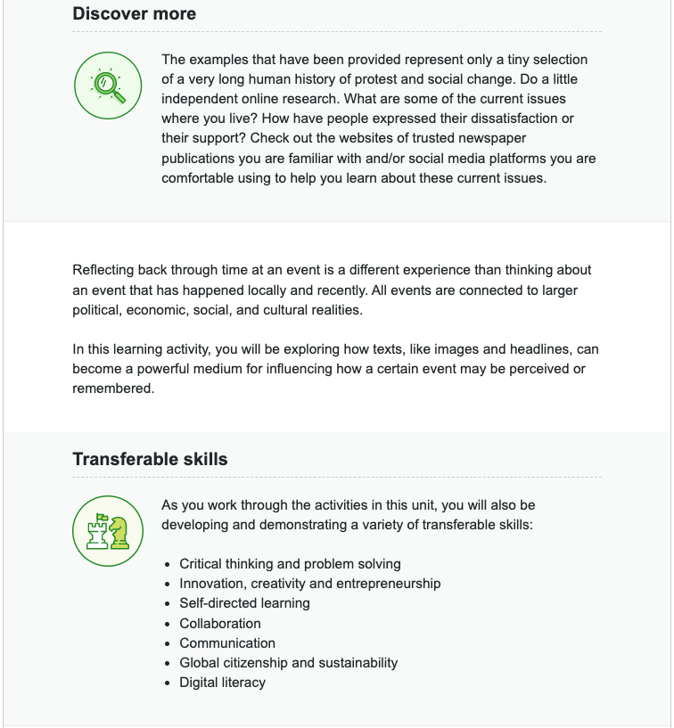
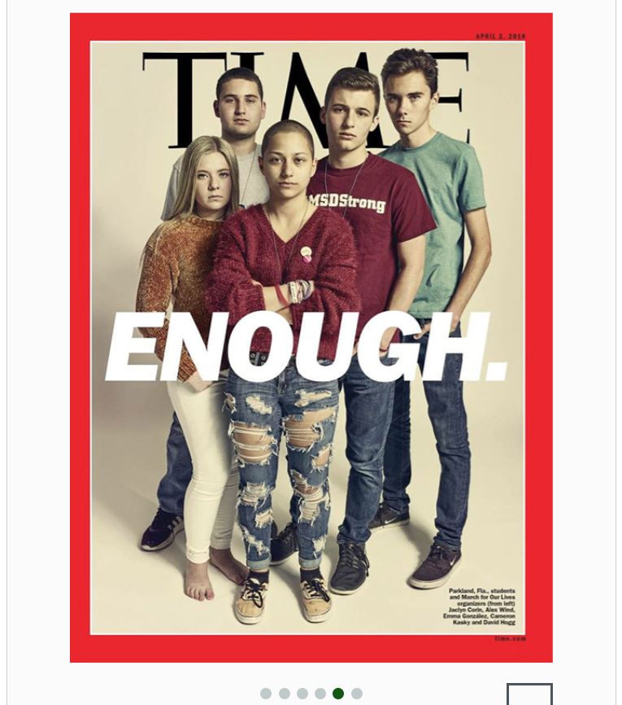

individuals
groups
societies
cultures 
overcome

barriers

systemic（adj） challenges 系统性挑战

social action

Greensboro 一个地名，City in North Carolina

sit-ins  静坐
protests 抗议

erupted over 爆发
 

- Critical thinking and problem solving
- Innovation, creativity and entrepreneurship
- Self-directed learning
- Collaboration
- Communication
- Global citizenship and sustainability
- Digital literacy

批判性思维和解决问题
创新、创造力和创业精神
自主学习
合作
沟通
全球公民和可持续发展
数字素养

Jot down 

