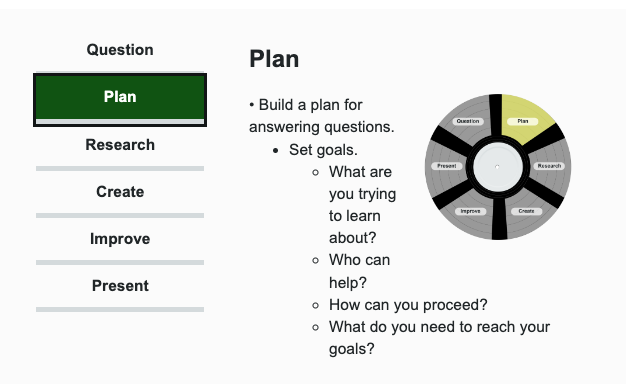

In the previous learning activity, you explored poets who have used their work to persevere in the face of oppression and injustice, and to inspire others.

Some of these poets were writing during the 1960s and 1970s, when counterculture movements of the twentieth century were at their height.

In North America, the 1960s and 1970s were marked by protests, riots, sit-ins, rallies, and marches against segregation, poverty, pollution, gender and sexual discrimination, and war.

This period of time gave us the Civil Rights Movement, the anti-Vietnam War movement, the women’s movement, the LGBT+ rights movement, the environmental movement, the free speech movement, and many more.

The counterculture and protest movements of the 1960s and 1970s inspired artistic expression. They produced great speeches, songs, and films that in turn, became an integral part of social change.

In fact, this continues to be the case today. As each generation explores ways to be resilient in the face of oppression and injustice, art and music emerge.

For the next assignment in this course, you will be selecting a song to research and analyze. In order to conduct research effectively, you must follow a methodical process.

In Unit 1, you followed the writing process to complete your personal essay. Now, you will learn about the following **six-phase research process** to plan and conduct research.

## Phases of the research process

Keep in mind that just as a DJ can move back and forth between sections of a record, you may need to move back and forth between phases of the research process. Press the following tabs for an explanation of each phase.

### 1. Question

Formulate questions by determining what you already know.

- Probe deeper about what you still need to know.
    - What does this mean?
    - Why does this happen?
    - How can it be changed?

### 2. Plan

Build a plan for answering questions.
Set goals.
- What are you trying to learn about?
- Who can help?
- How can you proceed?
- What do you need to reach your goals?

### 3. Research

Gather knowledge, skills, and/or material from outside sources.
Think about experimenting, tinkering, interviewing, and prototyping, in addition to traditional research.

### 4.Create

- Assemble your learning into an initial product.
- Incorporate what you have learned** into a new way of thinking, acting, and/or sharing**.

### 5. Improve

- Reflect on your initial product.
- Evaluate what works well and what needs to be improved.

Note
Often, you will have to revisit the planning and researching phrases for additional input.

### 6. Present

- Decide on when you're ready to share your work with the world.
- Implement your solution to the real-world problem you're addressing.

Research findings can be communicated in many different ways. Some examples include 
- research papers, 
- oral presentations, 
- posters, 
- and even slideshows. 

Next, you will specifically explore slideshows as media texts since they are effective tools in disseminating research findings.

## Slideshows as media texts

A slideshow is a form of visual media text that usually contains a combination of text and images/videos. The intent of a slideshow is to present key information and communicate a specific message. 

Slideshows can be used to supplement oral presentations as a tool to make the presentations more engaging. 

However, slideshows can also be created to serve as standalone media products to communicate information such as research findings.

Press the following tabs to explore considerations when planning and creating a slideshow.

### Planning your slide

- What message do you want to communicate with your slideshow?
    Consider the purpose of your slideshow when thinking about the message you want to communicate.

- How would you like to **structure** your slideshow to most effectively communicate that message?

- What **information** do you want to include to develop your message?

- What **order** do you want to present your information?

### Creating your slide

- What background, font style, font size, and font colour do you want to use for your slides?
    - The purpose of your slideshow is a key factor to consider when making decisions about these visual elements. For example, if your slideshow’s purpose is to communicate research findings, you would want to choose a background, font style, font size, and font colour that denotes professionalism and credibility.

- How will you incorporate spacing in the layout of your slides?
    - Considering spacing is important since you do not want your slides to appear too cluttered as it would impact the visual appeal of your slideshow.

- How will you concisely communicate information via text and images/videos?
    - When communicating information on slides, you need to be concise and to the point.
    - You should only include information that is relevant to the purpose of the slideshow and builds the message you want to communicate.
    - If you are making a slideshow to supplement an oral presentation, you can have significantly limited text since you will communicate most of the information orally.
    - When creating a standalone slideshow, you need to make sure to communicate all necessary information in your slides – but be concise and maintain appropriate spacing.
    - When selecting images/videos to utilize in your slideshow, make sure they help support the information presented.

### Try it!

#### Spotlight on social change

Now, you will be conducting research to put the spotlight on a topic related to social movements during the 1960s and 1970s or related to counterculture in Canada specifically. **You will need to follow the research process to conduct your research on your topic.**

Choose a topic from the following list as the focus of your research:

- The Civil Rights Movement
- The Anti-Vietnam War movement
- The Women’s Movement
- The LGBTQ+ Rights Movement
- The Environmental Movement
- The Free Speech Movement
- Social Change and Counterculture in Canada
- Canada in the 1960s
- Hippies in Canada

You will then create a **slideshow (10-15 slides)** to present your research findings. To create your slideshow, you may use Google Slides, Microsoft Powerpoint, Prezi, Keynote, or any other slideshow-generating platform you are familiar with.

Your slideshow must meet the following criteria:

- provides a brief overview of your topic
- includes at least 5 specific details that provide insight about topic
- explains how the effects of your topic can be considered in the current culture
- draws comparisons between then and now
- provides at least two additional resources where people can learn more about the topic
- incorporates images to make slideshow engaging and visually appealing

Once you have completed your slideshow, if you would like, you may share your slideshow with a trusted friend/relative to educate them about your chosen topic.

### Think
Since you just practised applying your research skills, think about the following questions:

- What do you think your strengths and weaknesses are as a researcher?
- Which research strategies did you find most effective?
- How comfortable are you with engaging in research tasks? Can you identify some skills that will help increase your confidence for research tasks?

### Exploring songs

Browse through the available songs in the following curated playlists. 
The curated playlists arrange the songs by decade and only contain audio previews and lyrics of the songs for you to explore. 

For the next assignment in this course, you will return to these playlists to select one song to research and analyze.

### Think

Once you have explored the audio previews and lyrics of the songs in the playlists, think about the following questions:

- What do you already know about these songs? How do these songs relate to protest, resilience, and social change?
- Which songs resonate with you the most? Why?

## Powerful voices

The sentiment that it is better to protest and advocate for what you believe in has been evident in the images, poems, and songs you have explored so far.

In fact, speaking, writing, and performing have long been linked to persevering through challenges and showing resilience. Audrey Lorde captures it beautifully in her poem, "A Litany for Survival".

### Notebook

Since you practised creating a media text in this learning activity by creating your own slideshow, reflect on the following questions in your notebook:

- What do you think your strengths and weaknesses are as a media creator?
- Which media creation strategies did you find most effective? Explain why.
- How comfortable are you with creating your own slideshow? Can you identify some skills that will help increase your confidence for these types of media creation tasks?

### Unit reflection

You have now completed Unit 2. 
Congratulations on your effort and engagement! 
In this unit, you explored thought-provoking images, powerful poetry, and inspiring songs, and you have thought critically about the ideas presented in them. 
You have challenged yourself to become both an interpreter and a creator of media texts.

Revisit your motivation sheet from the beginning of this course (back in Learning Activity 1.1). Make any changes to it based on how you felt working through Unit 2. What is your goal for Unit 3?

### Culminating project

As previously stated at the start of the course, you will select a novel to read independently in Unit 4 and use what you have learned in this course to create a reading journal for the [culminating project(Opens in new window)](https://course.ilc.tvo.org//content/enforced/22862564-ENG4C-EN-02-02-ON-(I-D-0922)/course_content/assignments/eng4c_u4la2_assign1.html?ou=22862564). If you would like to get a head start on choosing and reading your novel, feel free to go ahead and explore Learning Activity 4.1 to learn about the novel options you can choose from and the novel selection process you should follow to make an informed choice. If you would like to get a head start by starting to work on your reading journal for the culminating project, explore Learning Activity 4.2 for specific instructions and guidelines on developing a reading journal.