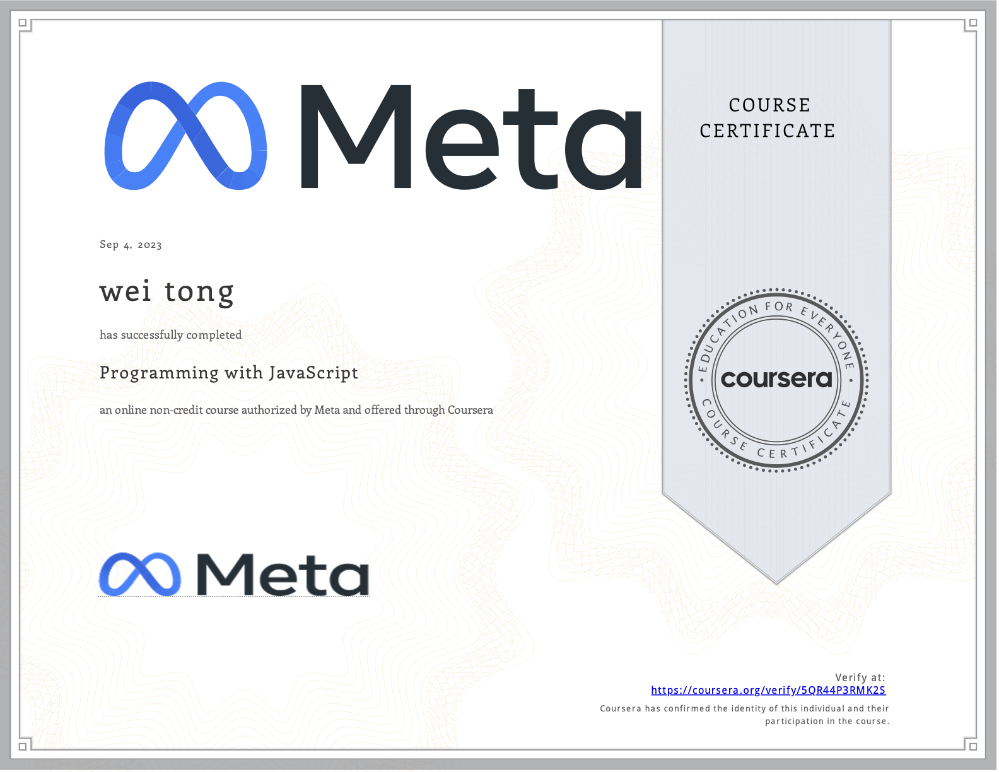

# Programming with JavaScript

- This directory contains all of my assignments from the Coursera Course: [Programming with JavaScript](https://www.coursera.org/learn/programming-with-javascript?specialization=meta-front-end-developer)

## Week 1: Introduction to Javascript
In this module, you are introduced to JavaScript. You'll learn why JavaScript is so integral to software development. And you'll get an overview of how to write JavaScript code inside the browser. Furthermore, you will learn about the most common operators as well as conditional statements and loops.

After completing this module, you will be able to:

- Explain the importance of JavaScript in software development
- Demonstrate how to write JavaScript code inside the browser
- Demonstrate how to write basic JavaScript code
- List **common operators, conditional statements and loops**
- Demonstrate how to use **variables** and output their value in the console
### 1.setting up

- 1.1_Introduction to Programming with JavaScript
- 1.2_How is JavaScript used in the real world?
- 1.3_Course syllabus
- 1.4_How to be successful in this course
- 1.5_How to Position Yourself for a New Career
- 1.6_How to uncover job opportunities
- 1.7_Setting up VS code (Optional)

### 2.Welcome to Programming

- 2.1_Introduction to programming
- 2.2_Why JavaScript?
- 2.3_Programming in JavaScript
- 2.4_Writing your first Javascript code
- 2.5_Variables
- 2.6_Data types
- 2.7_Operators
- 2.8_Numbers
- 2.9_Strings
- 2.10_Booleans
- 2.10_JavaScript improvements

### 3.Conditionals and Loops

- 3.1_Writing statements
- 3.2_Working with conditional statements
- 3.3_Looping constructs
- 3.4_For loop
- 3.5_While loop
- 3.6_Nested loops
- 3.7_Uses of loops
- 3.8_Module summary: Introduction to JavaScript

## Week 2: The Building Blocks of a Program

### 1.Arrays, Objects and Functions

- 1.1_Functions
- 1.2_Storing data in arrays
- 1.3_Introduction to objects
- 1.4_Math object cheat sheet
- 1.5_Math object
- 1.6_A closer look at strings
- 1.7_String cheat sheet
- 1.8_Typeof
 
### 2.Error Handling
Here you'll learn how to use objects, arrays and functions. In addition, you will learn about the most common built-in methods, and the difference between undefined, null and empty strings. And you'll explore both error handling and defensive programming.

After completing this module, you will be able to:

- Build and use objects, arrays, and functions
- List some common built-in methods on built-in objects
- Describe handling bugs and errors using try, catch, throw, and defensive programming
- Explain the difference between undefined, null, and empty strings
- Demonstrate how to write basic code using arrays, objects and functions

- 2.1_Bugs and errors
- 2.2_Try catch blocks
- 2.3_Undefined, null and empty values
- 2.4_Module summary- The Building Blocks of a Program

## Week 3: Programming Paradigms
This module is about functional programming and the object oriented programming paradigm. You will learn what scope is in JavaScript. You'll explore the differences between var, let and const. And you'll learn how to use classes and inheritance in object oriented programming. Additionally, you'll explore how to use write JavaScript using modern features like spread and rest. You will build code that can manipulate the DOM and handle events. And you will use JSON in JavaScript.

After completing this module, you will be able to:

- Outline the tenets of the functional programming and object oriented programming paradigm
- Describe how scope works in JavaScript
- List the differences between var, let, and const
- Use classes and inheritance in OOP in JavaScript
- Write JavaScript code using more modern features like spread, rest, template strings and modules
- Build code that manipulates the DOM and handles events
- Use JSON in JavaScript
###  1.Introduction to Functional Programming

- 1.1_Introduction to functional programming    
- 1.2_Return values from functions
- 1.3_Function calling and recursion
- 1.4_Introduction to scope
- 1.5_The functional programming paradigm
- 1.6_Visual Studio Code on Coursera
- 1.7_Building a functional program
- 1.8_Scoping with var, let and const
- 1.9_Comparing var, let and const

### Introduction to Object-Oriented Programming

- 2.1_Introduction to object-oriented programming
- 2.2_Classes    
- 2.3_Object Oriented Programming principles
- 2.4_Inheritance
- 2.5_Designing an OO Program

### 3.Advanced JavaScript Features

- 3.1_De-structuring arrays and objects
- 3.2_For-of loops and objects
- 3.3_Working with template literals
- 3.4_Data Structures
- 3.5_Spread operator
- 3.6_Rest operator

### 4. JavaScript in the Browser​

- 4.1_JavaScript modules
- 4.2_JavaScript DOM manipulation
- 4.3_JavaScript interactivity
- 4.4_JavaScript selectors
- 4.5_Event handling
- 4.6_Exercise- Web page content update
- 4.7_Exercise- Capture Data
- 4.8_Solution- Capture Data
- 4.9_Moving data around on the web
- 4.10_JavaScript Object Notation - JSON
- 4.11_Module summary-Programming Paradigms

## Week 4: Testing

Here you will learn about Node.js and npm. And you will explore how to install npm packages and how to work with package.json. Furthermore, you will learn about testing in JavaScript and you'll code a simple unit test in Jest.

After completing this module, you will be able to:

- Describe Node.js and npm
- Explain how to install npm packages
- Describe how to work with package.json
- Explain the process of testing in JavaScript
- List the three most prevalent kinds of testing
- Demonstrate how to code a simple unit test in Jest

- 1.1_Other JavaScript environments - node & NPM
- 1.2_Installing Node and NPM
- 1.3_What is testing?
- 1.4_Types of testing
- 1.5_Introduction to Jest
- 1.6_Writing tests with Jest
- 1.7_TDD (Test-Driven Development)
- 1.8_Module summary-Testing

## Week 5: End-of-Course Graded Assessment

In the final module, you'll learn about the graded assessment. After you complete the individual units in this module, you'll synthesize the skills you gained from the course to create code for the "Little lemon receipt maker ".

You'll also have to opportunity to reflect on the course content and the learning path that lies ahead.

- 1.1_Recap Programming with JavaScript
- 1.2_Congratulations on completing the course Programming with JavaScript
## Proof of Completion

