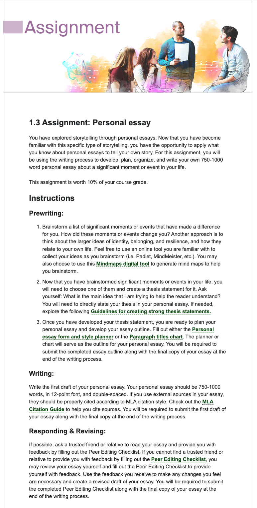
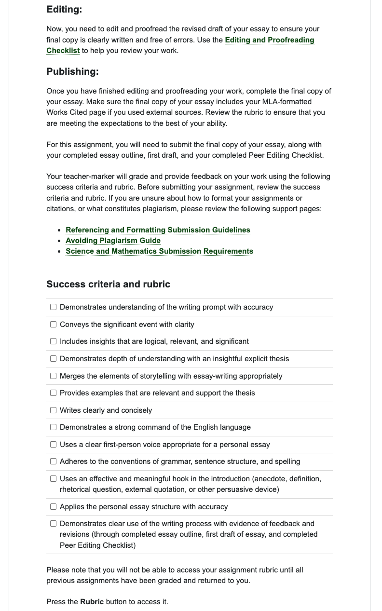

# Assignment: Personal essay

## 课文

## 学习资料

### Guidelines for creating strong thesis statements
创建强有力的论文陈述的指南
An effective thesis statement meets the following criteria:
• Substantial: A thesis should be something that people will be curious about and want to
read.
• Supportable: A thesis must be a claim that can be proven. The claim should not be just
a preference or opinion. It should be objective.
• Precise: A thesis is focused and specific. An effective thesis statement should be as
clear and specific as possible and not make overblown global statements. For example,
terms like “positive,” “negative,” “similar,” and “different” are too vague.
• Arguable: A thesis should be debatable, proposing an arguable point that can be agreed
with or disagreed with. Explicitly identify the assumptions you are making.
• Shows awareness of other angles: A thesis anticipates and refutes possible counterarguments.
Overall, be mindful of terms and categories that you are using. Make sure that you are
aware of all of the meanings and connotations of your words. Loaded terms such as “real,”
“believable,” “true,” “correct,” and “good” should be avoided because they have different
meanings for different people. 

### essay outline

1.3_eng4c_Paragraph_titles_chart.pdf
1.3_eng4c_01_personal_essay_planner.pdf

### 撰写过程中需要的资料

- MLA Citation Guide
https://course.ilc.tvo.org//content/enforced/22862564-ENG4C-EN-02-02-ON-(I-D-0922)/course_content/assets/locker_docs/eng4c_01.05.05.html?ou=22862564

- 1.3_Peer Editing Checklist.pdf

- Editing and Proofreading Checklist 
编辑和校对清单
[[1.3_editing and proofreading checklist]]

### 评分标准

Referencing and Formatting Submission Guidelines
参考和格式提交指南
https://faq.ilc.tvo.org/referencing-and-formatting-submission-guidelines/

Avoiding Plagiarism Guide
避免抄袭指南
https://faq.ilc.tvo.org/avoiding-plagiarism-guide/

Science and Mathematics Submission Requirements
科学和数学提交要求
https://faq.ilc.tvo.org/submission-guidelines-for-science-and-math-courses/