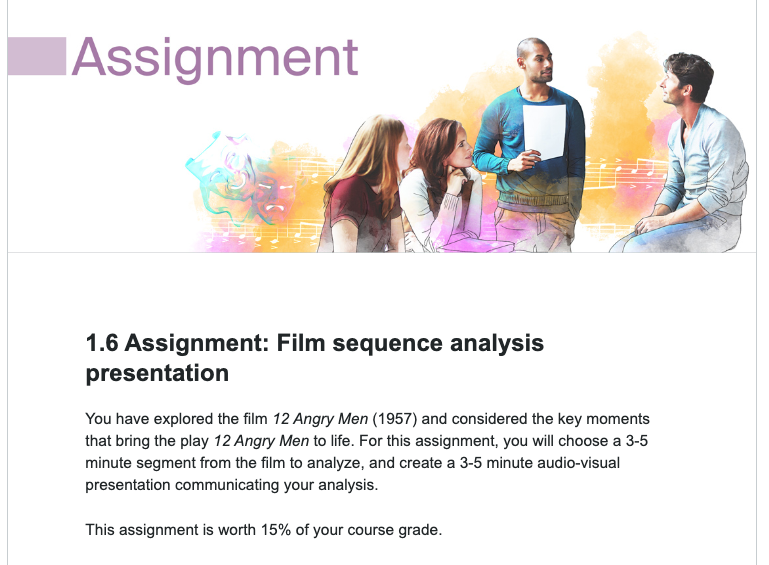
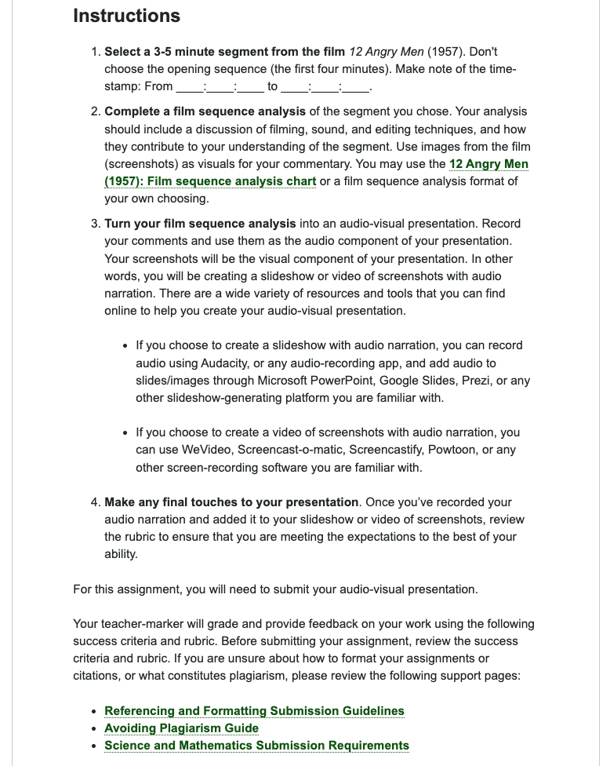
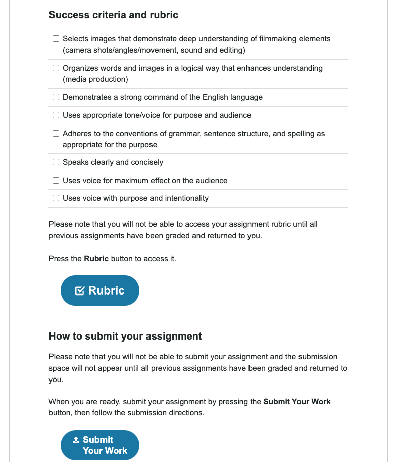

You have explored the film  12 Angry Men (1957) and considered the key moments that bring the play  
你已经探索了这部电影 12 愤怒的人（1957）并考虑了该剧的关键时刻_12 Angry Men 12 愤怒的人_ to life. 
生活。

For this assignment, you will choose a 3-5 minute segment from the film to analyze, and create a 3-5 minute audio-visual **presentation** communicating your analysis.  
对于此作业，**您将从电影中选择一个 3-5 分钟的片段进行分析，并创建一个 3-5 分钟的视听演示来传达您的分析**。

This assignment is worth 15% of your course grade.  
这项作业占你课程成绩的 15%。

1. **Select a 3-5 minute segment from the film** _12 Angry Men_(1957). 
Don't choose the opening sequence (the first four minutes). 
Make note of the time-stamp: From ____:____:____ to ____:____:____.

4. **Complete a film sequence analysis** 

of the segment you chose. 
Your analysis should include a discussion of 
- filming, 
- sound, 
- and editing techniques, 
- and how they contribute to your understanding of the segment. 
您的分析应包括以下内容的讨论
- 拍摄，
- 声音，
- 和编辑技术，
- 以及它们如何有助于您理解该细分市场。

Use images from the film (screenshots) as visuals for your commentary. 
使用电影中的图像（屏幕截图）作为评论的视觉效果。

You may use the [12 Angry Men (1957): Film sequence analysis chart.](https://course.ilc.tvo.org//content/enforced/22862564-ENG4C-EN-02-02-ON-(I-D-0922)/course_content/assets/locker_docs/eng4c_01_12_angry_men_1957_film_se.pdf?ou=22862564) or a film sequence analysis format of your own choosing.
您可以使用您自己选择的电影序列分析格式。

7. **Turn your film sequence analysis** into an audio-visual presentation. Record your comments and use them as the audio component of your presentation. Your screenshots will be the visual component of your presentation. In other words, you will be creating a slideshow or video of screenshots with audio narration. There are a wide variety of resources and tools that you can find online to help you create your **audio-visual presentation**.
**将您的电影序列分析** 转化为视听演示。 
记录您的评论并将其用作演示文稿的音频组件。 
您的屏幕截图将成为演示文稿的视觉组成部分。
换句话说，您将创建带有音频旁白的幻灯片或屏幕截图视频。 
您可以在线找到各种资源和工具来帮助您创建视听演示文稿。

- If you choose to create a slideshow with audio narration, you can record audio using Audacity, or any audio-recording app, and add audio to slides/images through Microsoft PowerPoint, Google Slides, Prezi, or any other slideshow-generating platform you are familiar with.
- 如果您选择创建带有音频旁白的幻灯片，您可以使用 Audacity 或任何录音应用程序录制音频，并通过 Microsoft PowerPoint、Google Slides、Prezi 或您使用的任何其他幻灯片生成平台将音频添加到幻灯片/图像中。 熟悉。

- If you choose to create a video of screenshots with audio narration, you can use WeVideo, Screencast-o-matic, Screencastify, Powtoon, or any other screen-recording software you are familiar with.
- 如果您选择创建带有音频旁白的屏幕截图视频，您可以使用 WeVideo、Screencast-o-matic、Screencastify、Powtoon 或您熟悉的任何其他屏幕录制软件。

3. **Make any final touches to your presentation**. Once you’ve recorded your audio narration and added it to your slideshow or video of screenshots, review the rubric to ensure that you are meeting the expectations to the best of your ability.
3. **对演示文稿进行最后修改**。 录制音频旁白并将其添加到幻灯片或屏幕截图视频后，请检查标题以确保您尽最大努力满足期望。

For this assignment, you will need to submit your audio-visual presentation.

Your teacher-marker will grade and provide feedback on your work using the following success criteria and rubric. Before submitting your assignment, review the success criteria and rubric. If you are unsure about how to format your assignments or citations, or what constitutes plagiarism, please review the following support pages:
您的评分老师将使用以下成功标准和评分标准对您的作业进行评分并提供反馈。 在提交作业之前，请查看成功标准和标准。 如果您不确定如何格式化您的作业或引文，或者什么构成抄袭，请查看以下支持页面：

Selects images that demonstrate deep understanding of filmmaking elements (camera shots/angles/movement, sound and editing)

Organizes words and images in a logical way that enhances understanding (media production)

Demonstrates a strong command of the English language

Uses appropriate tone/voice for purpose and audience

Adheres to the conventions of grammar, sentence structure, and spelling as appropriate for the purpose

Speaks clearly and concisely

Uses voice for maximum effect on the audience

Uses voice with purpose and intentionality
选择能够展现对电影制作元素（镜头/角度/运动、声音和编辑）的深刻理解的图像
以逻辑方式组织文字和图像以增强理解（媒体制作）
表现出很强的英语能力
针对目的和受众使用适当的语气/声音
遵守适合目的的语法、句子结构和拼写惯例
说话清晰简洁
使用声音对观众产生最大的影响
有目的和意图地使用语音